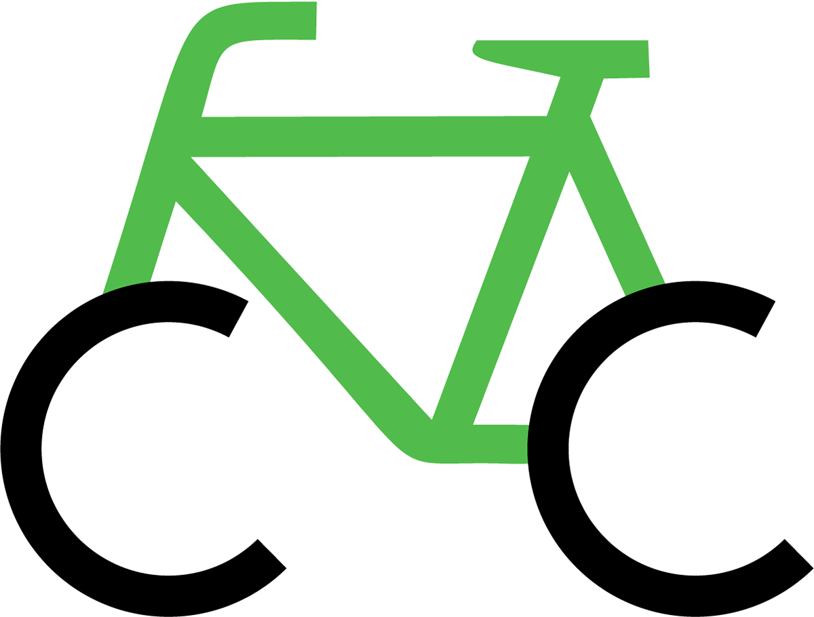
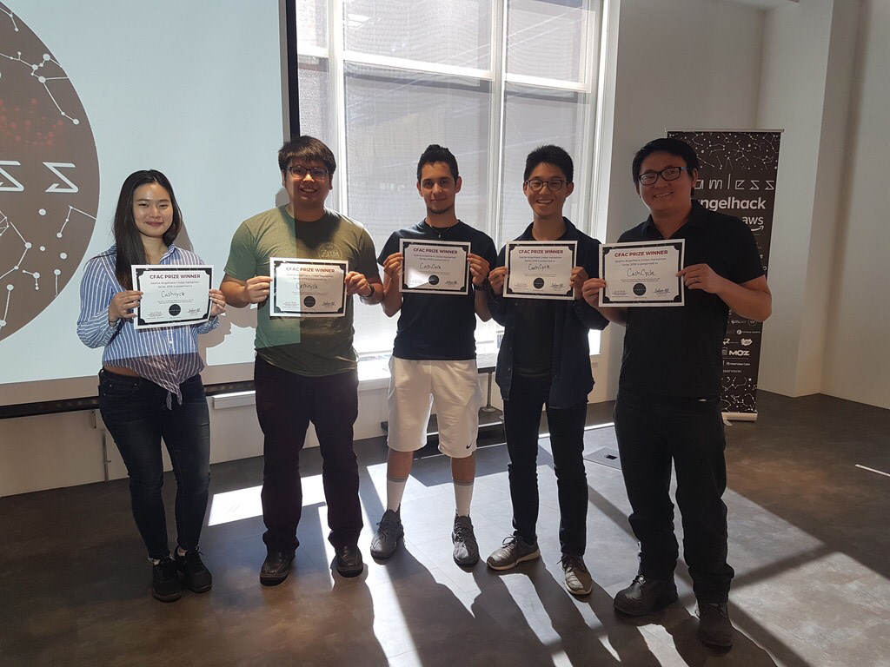

#Overview
Angel Hack was the very first hackathon I attended. It was a rollercoaster of an experience that ultimately ended in a success. It was such an amazing experience. I was glad to be part of a fun and supportive team. My role involved front-end development using HTML/CSS and Javascript using the Material Design framework.

##Code for A Cause
Code For A Cause Impact Award Challenge is one of the challenges presented by the Angel Hack team.
The objective is to build a technology that solves a social or environmental problem and positively impacts your local community.

#Situation
The increase in bike-sharing applications and its services contribute to environmental pollution by littering city streets and the abandonment of bikes due to over-production.​​​​​​​

#Solution
Cash Cycle hopes to be part of a solution as a mobile app service giving incentives to individuals who can move stray bikes to the desired location, decreasing litter and abandonment of bikes on the streets.
​​​​​​​
Cash Cycle's aim is to benefit both the city, its users, and bike-sharing services. It can offload the amount of labor and cost by having users transport the bikes to the appropriate location. Users are rewarded for working these short jobs, so bikes can be less of a litter and more of an advantage to a city.

There are a thousand cities worldwide using bike-sharing services. 120 cities using this service in the USA with around 3 bike sharing companies per city. This is a market that desperately needs some kind of change that will truly benefit and contribute to the betterment of the environment and the community it serves.

#How Cash Cycle Works

Our working prototype involved using Google Maps API to create a list of routes that serve as jobs for the user. These jobs show the amount of distance from the location of a 'stray' bike to their appropriate location, as designated by the bike-sharing service. The greater the distance, the larger the incentive for the user. Each job requires a certain amount of time to be completed, which is derived from the calculated route time and some padding.

##Front End Development
My role involved developing the front-end to show a working prototype during presentation. I used Material Design Lite as a framework to create a mock Android app using the web browser. Having that framework made the design process so much easier, especially during crunch time. Being able to use their components and styles for consistent design was something I took advantage of. The majority of my time was then spent using Javascript to tie in the back-end with the front end, to make it interactive in real-time.

#Winning Runner-Up!
Our project won us the Code for a Cause Impact Challenge. This award won runner-up among the line-up of projects presented that day.

