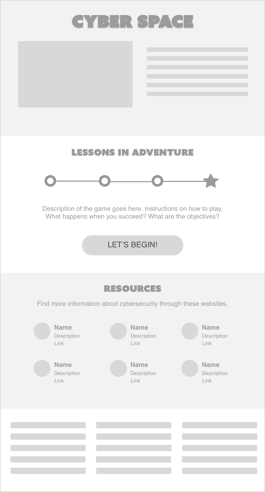
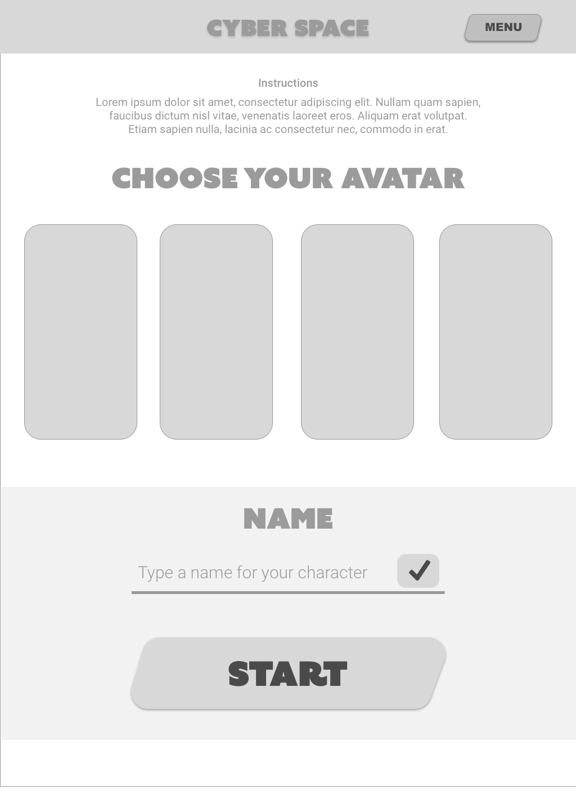
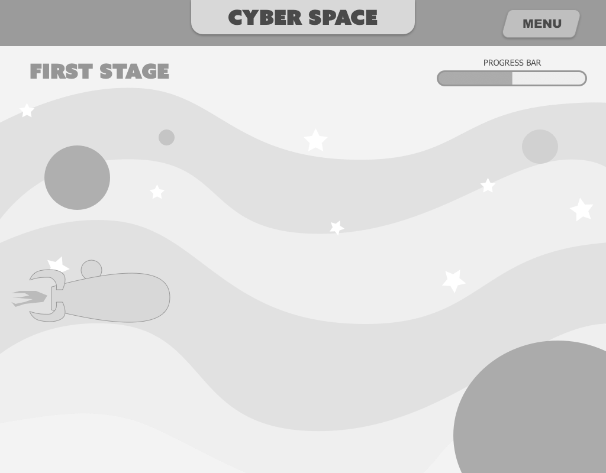
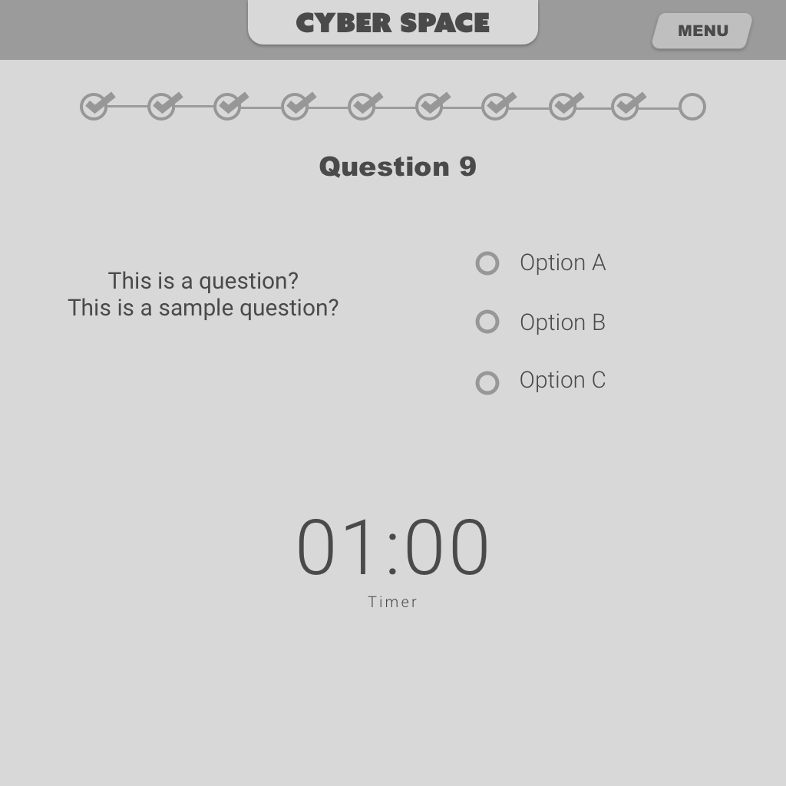
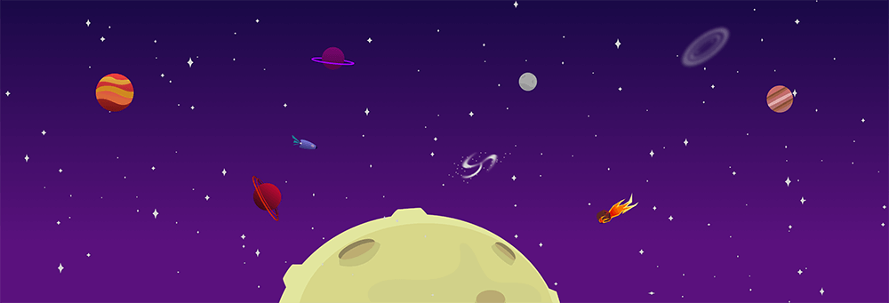
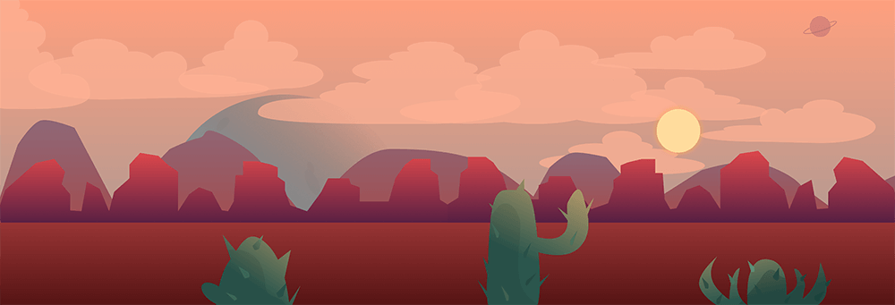
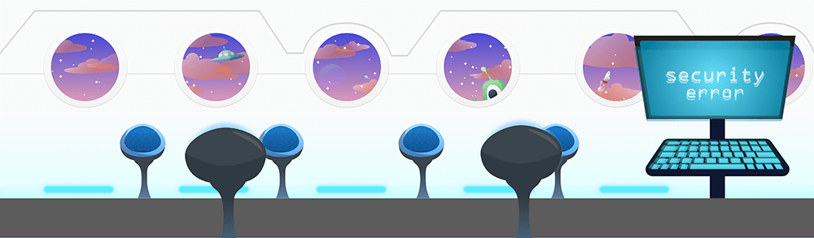

##Demo the Website
You can visit the website by clicking [here](http://students.washington.edu/galvc/Group%20Project/home.html)

Navigating is easy and simple. Before the game starts, a dialog box will pop up and instruct the user about the game mechanics and requirements. Inside the webpage is a progress bar that tracks the user's status until they get to the end of the page. There are three stars and label to the right side that also tracks the amount of orbs they have opened. The user must reach the end of the page and have clicked all the orbs to move to the next stage,

##Overview
Client: Infragard
Audience: Children ages 8-12 years old
Goal: Teach cybersecurity concepts, netiquette, and web terminologies to children
Role: Front-end development, graphics design, wireframing

##Process
Knowing our audience were children, we decided that an interactive web game will help capture the attention and interest of children long enough for them to peruse technical concepts. With the help of existing resources and the guidance of our Subject Matter Expert (an adviser that our professor connected us with), we grouped our lessons under themes and kept the sentences to a minimum.

There are three stages representing its own theme. The user will go through the stages in a linear manner. After each stage, they must get 80% of the quiz correctly, challenging their knowledge based on the lessons they previously learned.

#Requirements
We researched and communicated with out Subject Matter Expert on what methods work with children and the best way to create a learning experience. We developed our requirements based on these discussions.

• Use a bright and colorful palette
• Create appealing graphics in cartoon style
• Develop a simple, linear user flow
• Develop a suitable and appropriate content length aimed at children's level of comprehension skills and attention span
• Provide tutorials, hints, and visual cues inside the web game

##Mockups

Main Page
Includes an introduction to the game, explains the importance of teaching Cybersecurity to young children and lists resources we used for both development and content creation

Character Creation
To make the game more engaging, we thought we could have a character creation page where users can have more agency, engagement and customization choices. Due to time constraints, this page was scrapped.

Game Page
The user's avatar exists on the left side of the page. The user will scroll their mouse downwards for their avatar look as if they are moving horizontally across the screen. The environment and color palette is different for every stage, showing a progression of story line.

Quiz Page
After learning new concepts and terminologies, the user must complete and pass a quiz that will take them to the next stage.

##Assets

