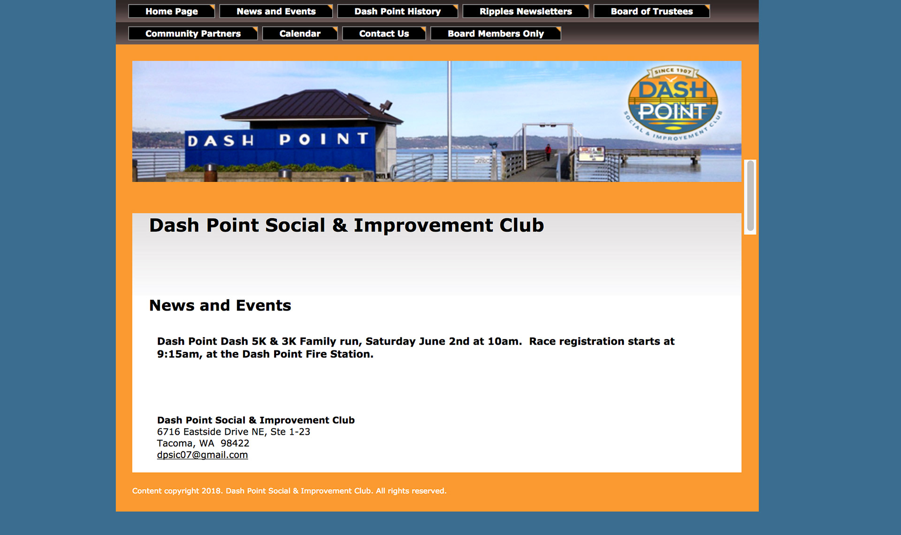
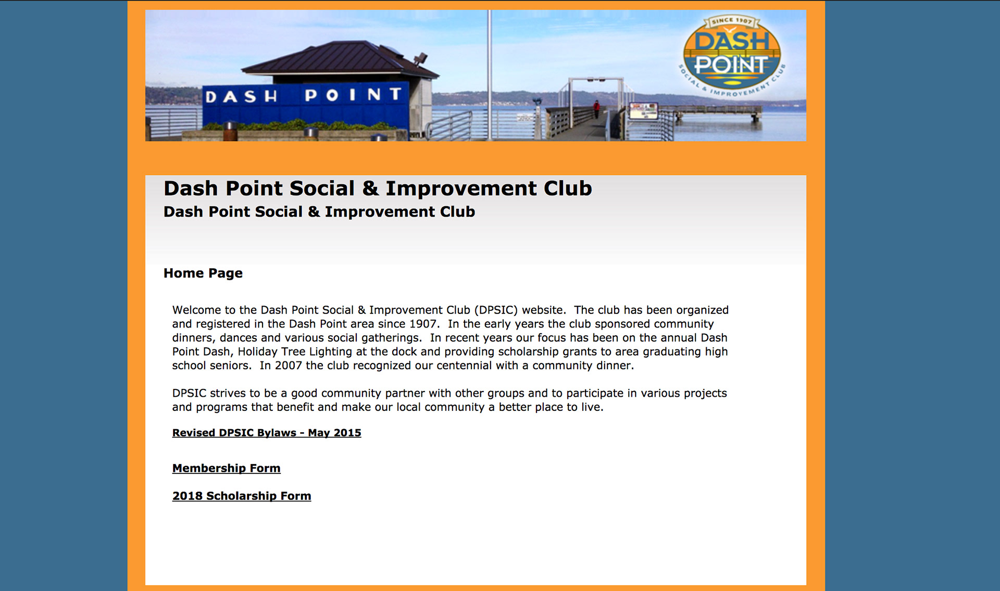
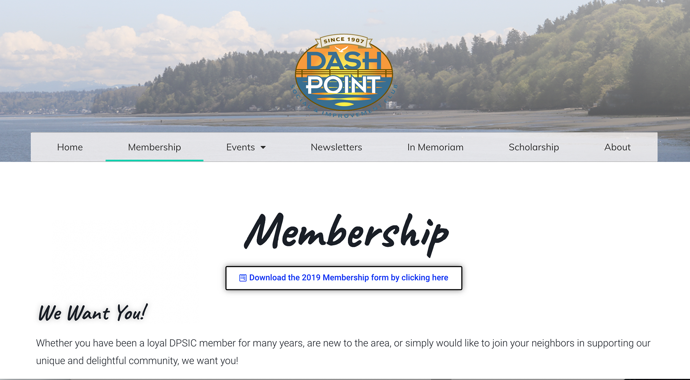

##Situation
Dash Point is a community in Pierce County, Washington. The Social and Improvement Club is the group that handles the ongoings of the community, including the maintenance of their official website. The group manages memberships, events, scholarships, and newsletters among many other activities.

Their previous website was made through a website builder of their hosting company. There was very limited design options and adding content was not intuitive. This difficulty led to less maintenance, frustration and annoyance to the members of the club. This also meant there were less than desirable traffic to the website.

The board that runs the club and manages their previous website found it very difficult to navigate and add content to their website. They needed a faster and user-friendly way to accomplish this. In addition to that, they were paying a costly amount of money for a website that was hardly maintained and updated.

##Goal
Per client requirements and needs, we evaluated that we should redesign their website to create a user-friendly and accessible website for their community. This involves moving away from their host's website builder and migrating their files and content management system to Wordpress.

At the end of this project we aimed to:

- increase club membership and reach a wider demography
- simplify membership and event registration using online tools
- disseminate community news quickly and efficiently
- increase the storage capacity of their website

##Before

##Solution

#Providing a Content Management System
We used Wordpress for its customizability, user-friendliness, and large base of support. Once we handoff to our client, we want to ease their worry about the design and technicalities of managing a website and focus more on reaching their members.

#Visiting the Dash Point Community
To better understand the community, we visited their neighborhood. We also took pictures and videos to use as assets and beautify the website.

#Training
We knew the importance of documentation, and strove to keep our training and handoff documents accurate and updated. We kept in contact with a key person in the club to pass down the knowledge on using CMS, adding events, adding pages, and editing the design of the website.

##Learnings

This was an incredibly eye-opening experience on client-interaction and team dynamics. Because we were able to use tools and our experiences from previous projects, delivering a completed website was actually the easy part. The bulk of the learning experience comes from documentation, client meetings, client requirements, scope creep, and technical problems that we didn't foresee.

It was fortunate that we were good at preparation, organization, and time management. Those were definitely the key to avoiding total chaos. Having a time limit of three months, the scope creep was real.

