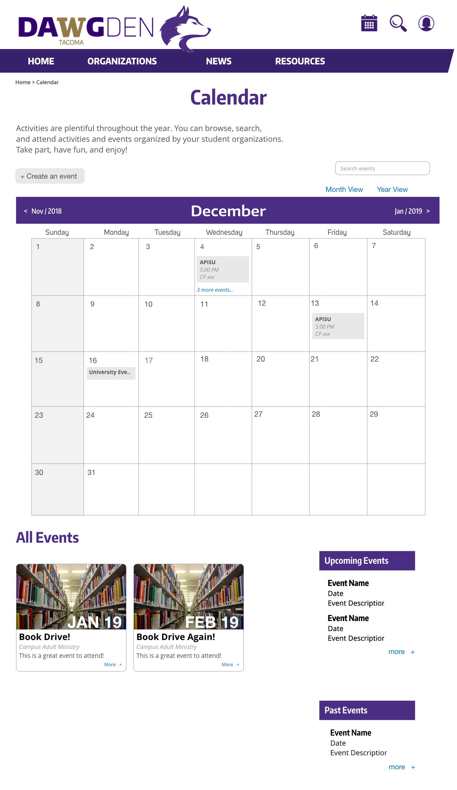

##Current Situation
Dawg Den is the UW Tacoma's official website for school organizations. It is the hub for all the organizations, theire news, members, and club management. The website is publicly accessible by anyone. Students can log in, message, and request to join an organization. Officers can manage members, send requests, and access official documents. We were tasked to modify the website's user interface and solve their design problem.

##Problem
Club officers find their current system does not promote communication and timely organizational requests. It does not serve their needs in coordinating and communicating organizational activities with members and officers. They also believe the current system of organizational requests to the university’s various offices could be better reworked using digital documents and systems. Procedures such as requesting for funding or using rooms for events and activities from beginning to approval are still done manually.

##Objectives
Propose a friendlier interface and system assisting club officers with managing their forms, requests and communication with club officers and members.
Website features
We found that by giving the users a central place for their frequently used links, as well as giving them more communication capabilities and reach helps them manage their organizational needs better.

##RSO Member Dashboard
RSO (Registered Student Organization) officers have the capacity to log in the Dawg Den website and access certain features locked from the public and regular students. Because officers have responsibilities to their organization, the wireframes below propose ways to manage communication, handle requests, and organize events.

##Inbox
Communication is integral to running an organization smoothly. The Dawg Den website limits this because there is no medium of communication within organizations or University offices. This proposed inbox serves as a repository for notifications, student membership requests, and messages from school officials. With this, there is finally a way to combine all the important messages and keep them for historical purposes.

##Requests
Requests are forms that organizations complete and comply with to accomplish large activities involving school funding, organizational change, or other permissions involving the school and its space.
Currently, these documents can be accessed only through the front page of its website. It must be printed out and handled manually by the members and submitted to the offices. The process is lengthy.
Here, the requests can be accessed through the dashboard and completed online. The documents will be digitally sent over to the respective offices. Once the request has been processed, a notification will be sent to the organization's inbox and its status under the Request page is changed.

##Events
There are numerous RSOs but they are not in contact with one another. To determine the best date and location for an event, it would be helpful to know about other organizations' plans. The university itself is small and there are limited spaces to hold events. Having a calendar that can show all upcoming and potential events for all RSOs is another user requirement that was identified.

This event page allows anybody, regardless of their organizational standing, to view all activities for the rest of the year. This page also offers a feature for an officer to complete an application form to book a date and space. To provide more engagement with users, there is also section of articles to promote activities and encourage student activity.

##Final Designs

##User Feedback
We recreated the mockups in WIX so they can be navigable for testing. The prototype enabled us to present this proposal to club presidents. We received positive feedback notably its simplicity and features such as the calendar, forms, and messaging.
