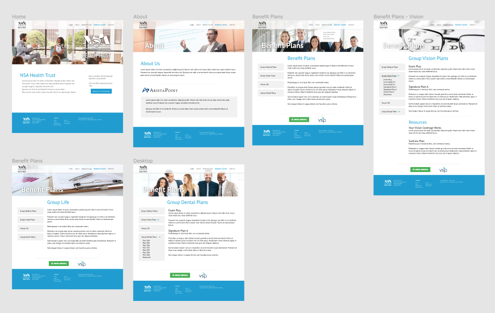

#View the Website 
View the [website](http://nsahealthtrust.com)

#Role 
I worked with another web developer to code this website. I led the design and prototyping phase following the brand guidelines
of its main organization the National Speakers Association (NSA). We collaborated using Figma, Azure DevOps, and Microsoft Visual Studio.

#Design

The color scheme is based on the NSA brand guidelines. 
It was important to create a clear structure and navigation considering health benefits can be complex so the menu and the sidebar
were kept to a minimum to ensure clarity. 

##Imagery 
It was important to show imagery that featured professionals of all levels and ages.
Because this website is aimed at professional public speakers, it was fitting to use stock photos of energetic, bright individuals
onstage or exchanging ideas.

#Lessons
- Having a defined coding convention and guideline ensured consistency. With two developers working on this site, 
this enabled us to quickly understand each other's work regardless of our respective sections. Example: 
BEM CSS naming
- Pair programming and coding the layout of the website together allowed us to understand each others' styles.
We also defined goals early on. 
- Keeping it simple ensured that the website would work across different versions of browsers. 
- Mobile styles should be considered early on to prevent major changes to the code.
- Having content and copy early is significant in dictating the design, code, and performance of the website. 