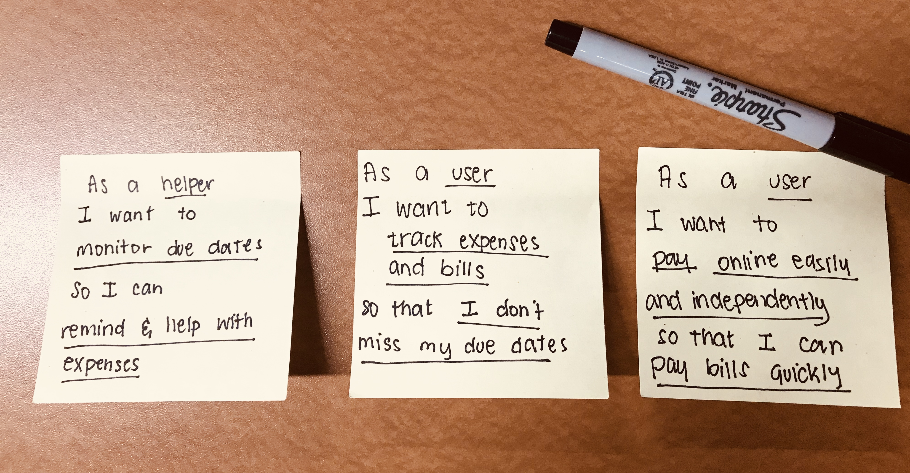

##Case
Tracking finances is no easy task. And it’s no easier managing someone else’s.
This project is inspired by my own personal struggles with organizing my Grandmother’s expenses and bills.
This is an exploration into a mobile application that: allows sharing, collaboration, and management of data between two people and examines how user interfaces can be more accessible towards those who are not technologically-inclined.
Statement of accounts, scrawled notes, and checks scattered around the couch and desk - that’s how I find my grandmother every time she attempts to pay her bills every month. It’s tiring for both her and I to get everything organized and under control. Piles of papers from past months get lost within the pile, some statements can’t even be found anymore. Several times a month, she approaches me for help in paying some bills online. (Old habits die hard; Mailing checks is still her preferred choice of payment) More often than not, it’s because the bill is approaching or past its due date.

Now I’m thinking, is there a way for us both to be on top of things?

##Situation

1. Bills have various due dates in a course of a month. It can be very difficult to remember the dates, amount, and ways to pay them.
2. I, as a helper, am not physically able to be with her often.
3. As an elder, she needs constant reminders and motivation.

##Ideation
A good deal of financial application that track, monitor, and let you authorize payments online already exist. This application does not aim to fit into those niche. I decided that the main goal of this application is:
be a medium to provide help and guidance.
This application aims to be an aid for seniors like my grandmother. My observations show that they are reluctant and afraid to learn or change despite being fascinated and eager to make sense of technology. I wanted to create an accessible application that will help at least two people in cooperation to manage finances regardless of distance.
PayMate is a solution that allows two people to be a central user and a Mate. The Mate is able to monitor and track payment activities. With permission from the central user, they can also authorize payments and create Bills in their stead. The priority of this app is bridging the goals of both the user and the Mate.

##Persona
The Grandmother
She is an elderly female aged 63. English is her second language. She understands it completely but has trouble expressing herself in English. She works in healthcare and loves to help people. Her favorite hobbies are dancing and cooking. She loves socializing, catching up with friends on the phone, and spending time with her family.

Her usage and behaviors
Even at her age, she strives to learn new things that can help improve her daily routine. She recently just learned how to start and accept video calls in Facebook. She owns an old iPhone and enjoys playing casino games with their flashy music and animations. She spends an average of around 3-5 hours on her phone which includes calling, texting, and occasionally playing games.

Beyond the games and basic functions of her phone, she is not familiar with the other features a smartphone has to offer. She is afraid to explore and make mistakes. She doesn’t understand icons and symbols that carry meanings and make sense unlike the general user. She is unable to remember website navigations and needs heavy guidance.

My grandmother was able to learn to make FaceTime and Facebook calls because of repetition and its easy navigation. I find that if anything derails that routine (like alerts, errors, or popups) she becomes confused and is unable to move forward. She frequently fears that pressing a wrong button might lead to her getting charged without her knowing. She has approached me several times with questions about a certain popup, not knowing there is always an option to go back to the previous page, or close the popup window.

##Insights
Because she did not grow up using smartphones heavily in her daily life, she is unable to understand and apply concepts, schemes, and terminologies of any kind. She is able to pick up on concepts that she is already familiar with in real life (email, caps lock) but concepts (menu, navigation, username) are still a hard reach. Combined with her issues as a person whose second language is English, it is quite hard sometimes to explain certain processes to her even though she desires to master them.

Here are the important insights I gathered:

1. Routine and simplicity is key.
2. Unfamiliar icons and symbols should be avoided.
3. Navigation should be kept to a minimum. If it is not possible, the path must be straight and direct. Always create an option to return to the home screen.

##Approach
I decided that the ecosystem of the application needs to be as simple as possible. Each button on the main screen leads to as few pages as possible. This fulfills the application's goal to be direct and straight to the point.

Three of the selections from the main menu eventually lead to the BILL PAGE. This is because all repetitive information is merged into one screen. Pay, View All Bills, and Calendar are all different selections because they present data for different purposes.

##User Stories
Three user stories were identified to help create a short list of features and functions.!

##Functions
Function
Pay accounts online
Access bill account details
Integrate the application's calendar with the user's phone calendar
Allow the Mate to request permission to access an account, authorize payments, create bill accounts

##Features
Notify the user and send alert for permissions, authorizations, and reminders
Notify the Mate for help and reminders
Message, email, call, send a notification to the Mate
Track all activities for all actions done inside the application

##Mockups

##Insights
I believe a well-designed user interface is functional first and pretty second. I value beautiful aesthetics but as I delve further into exploring accessibility, I have to keep in mind how to merge them together.

This is an ongoing project in understanding accessibility for seniors though my main target is my grandmother. Through feedback and iteration, I learned to: keep my pages at a minimum, choose appropriate visual aids, label symbols, check myself when I am making assumptions, request feedback regularly, and create multiple paths to a goal.
