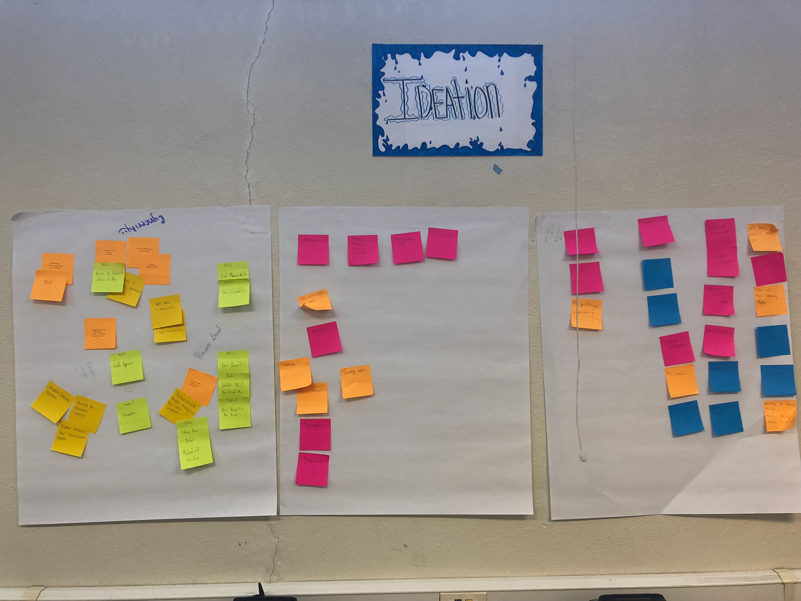

##Quick Links
Read my blog post [here](https://blogs.uw.edu/emar/archives/583)

Follow and learn more about Project EMAR using the links below:
[Blog](http://blogs.uw.edu/emar/), [Twitter](https://twitter.com/RobotEMAR), [Instagram](https://www.instagram.com/projectemar/)

##Overview
The overall goal of this project aims to help high school students through robots. I provided support and mentoring to local high school students in Tacoma participating in the Robot Design Challenge. This culminated as an event at UW-Seattle.

##Experience

As part of the research group, my efforts include planning and mentoring high school students that will participate in the Social Robot Design Challenge. The goal of the students is to create their own robot prototype that will help manage stress in the context and condition of their school environment. In the course of five weeks, we mentored students using the Human-Centered Design process (Research, Ideation, Prototyping, Testing, Iteration).

We held interactive discussions with students using classroom tools and Powerpoint slides. Along with the help of their advisor, we were able to step through each of the Human-Centered design process for every visit. We employed various methods like brainstorming, affinity diagramming, and storyboarding for the ideation phase and the Wizard of Oz method for usability testing.

The culmination of those efforts was the Design Challenge held in UW Seattle. Representatives from each school attended to present their work and process. The event was a success, offering a glimpse into the creativity of the teens and their insights on reducing stress for themselves and their community.

##Poster for Colloquium Presentation

##Team Pictures

