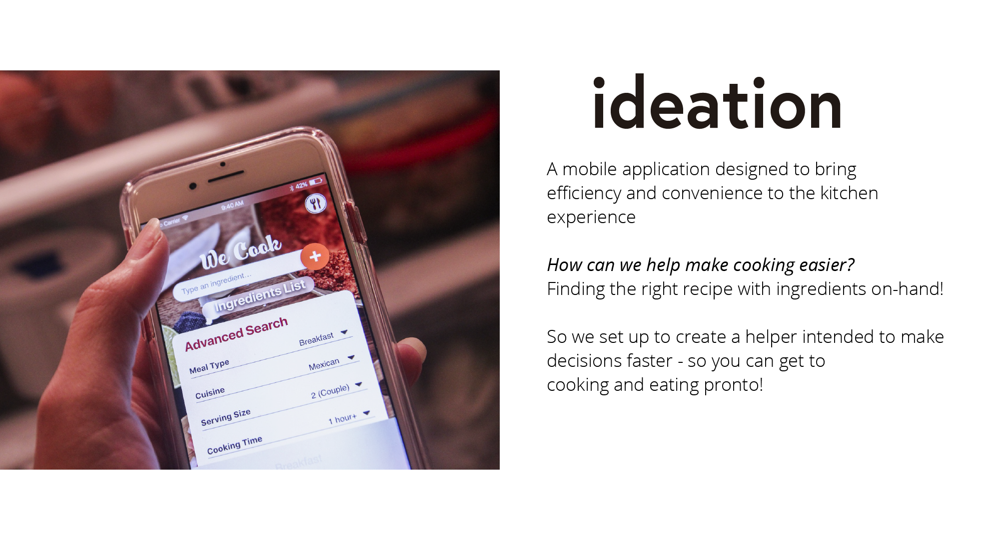
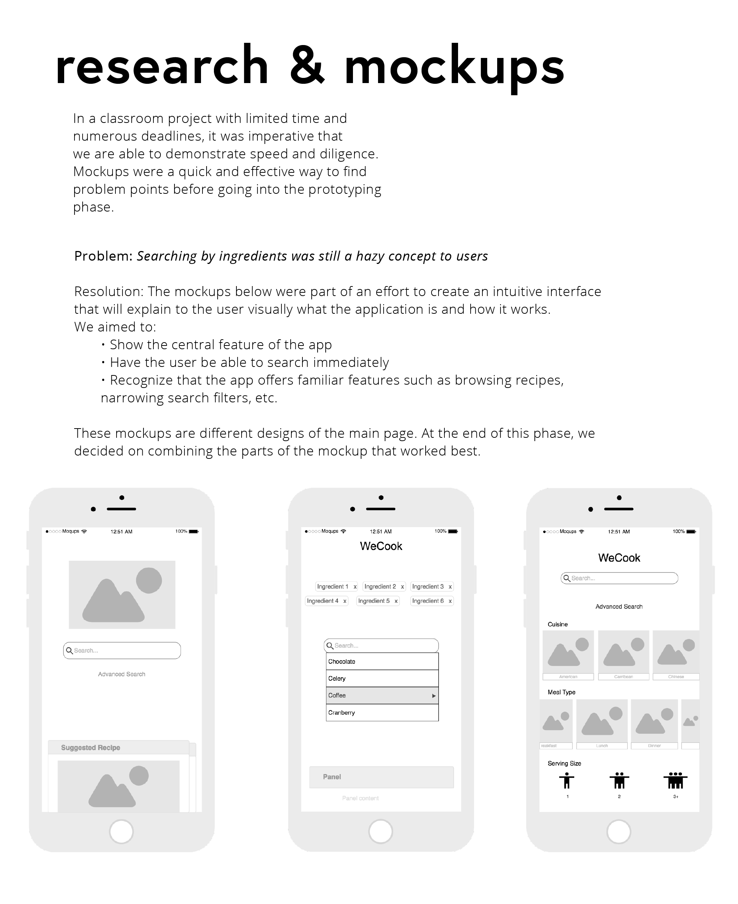
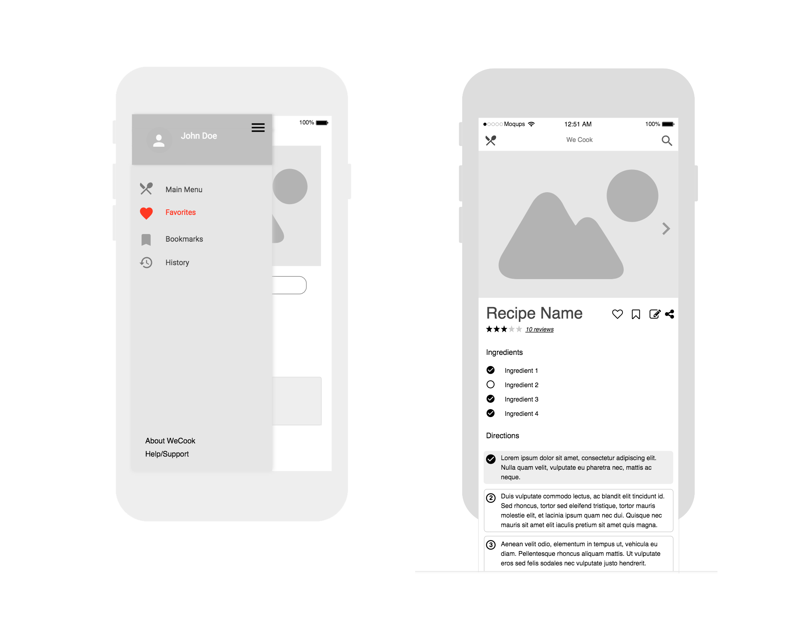
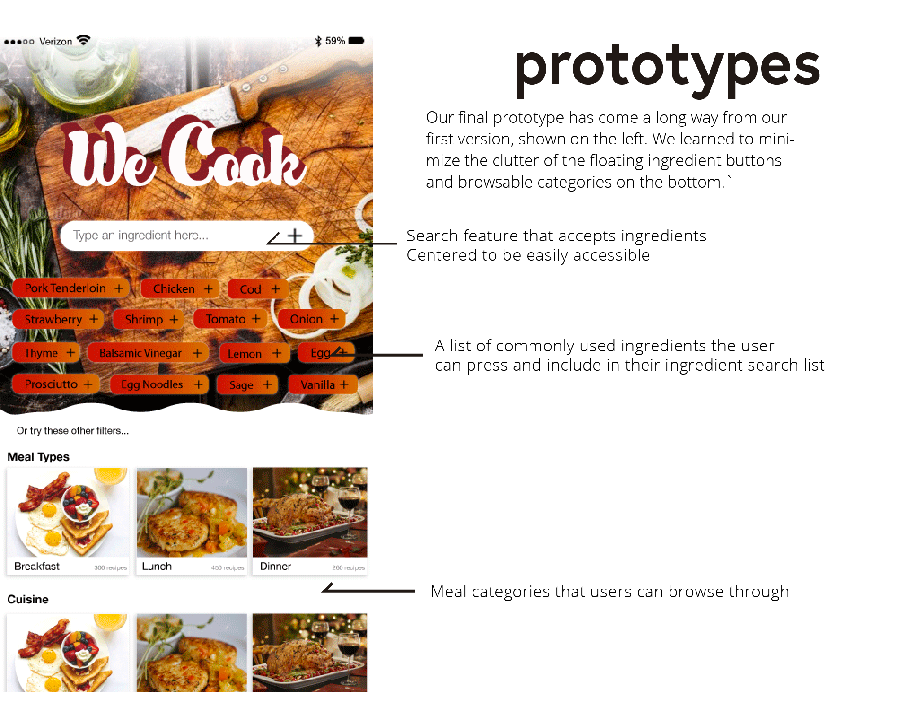
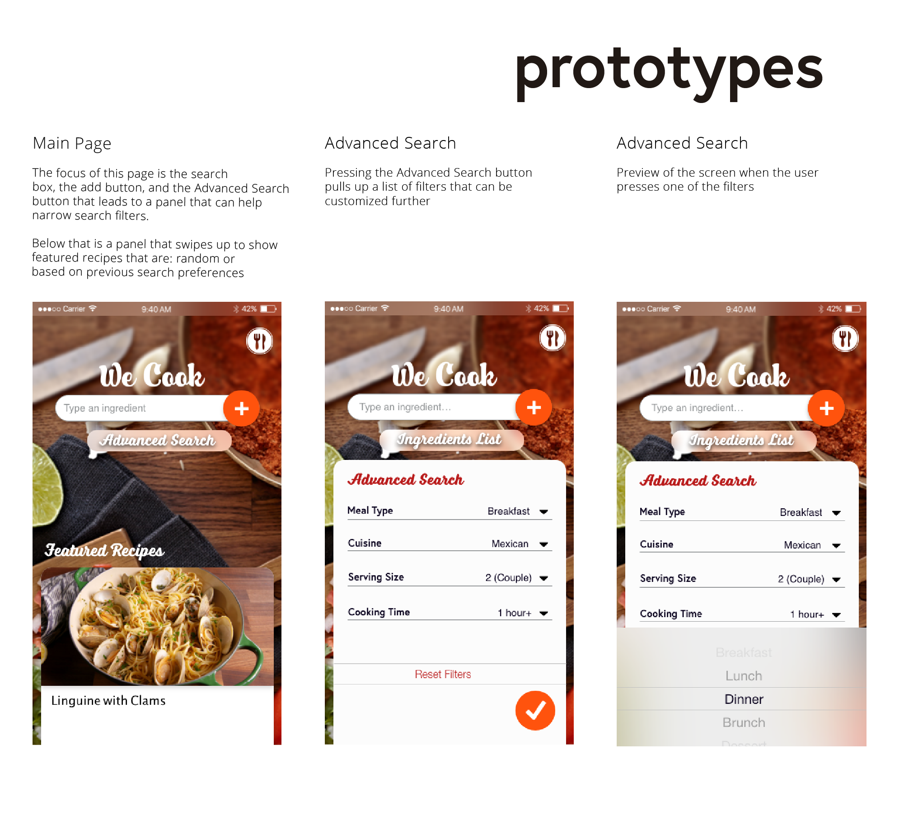
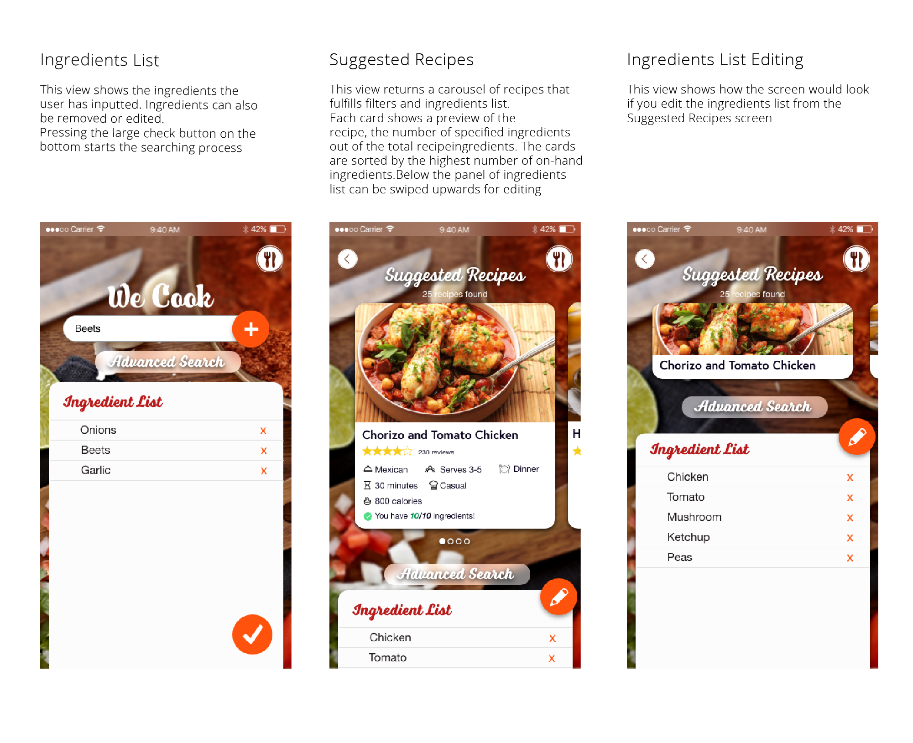
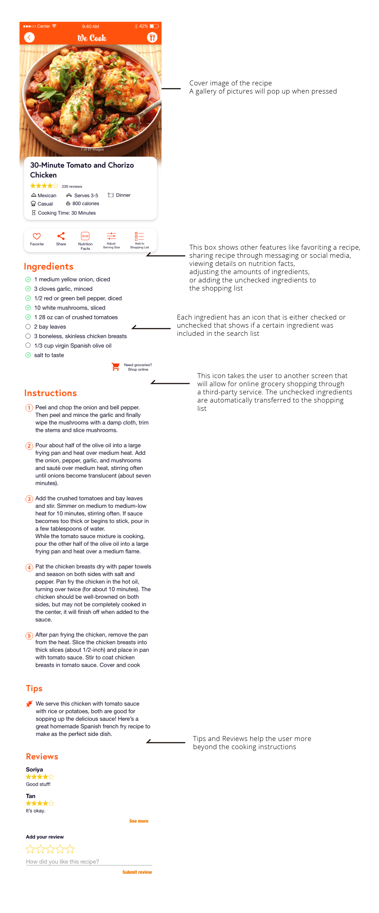
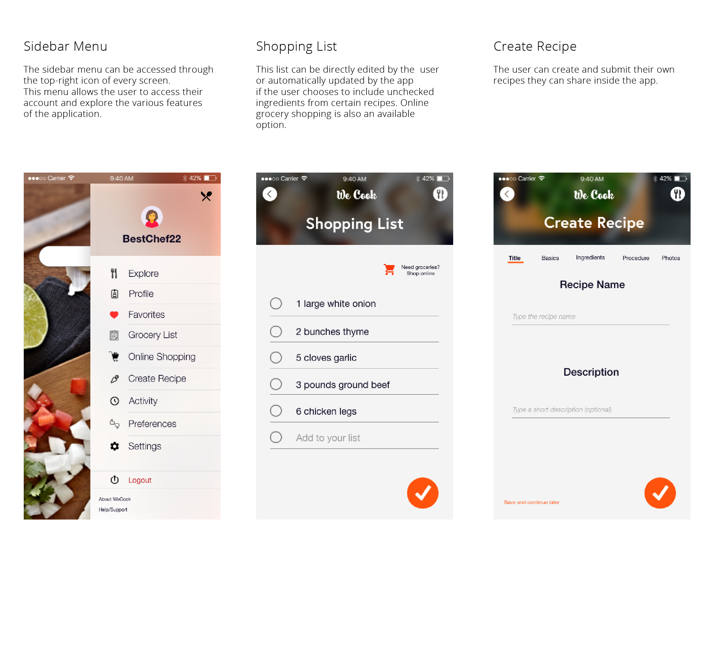
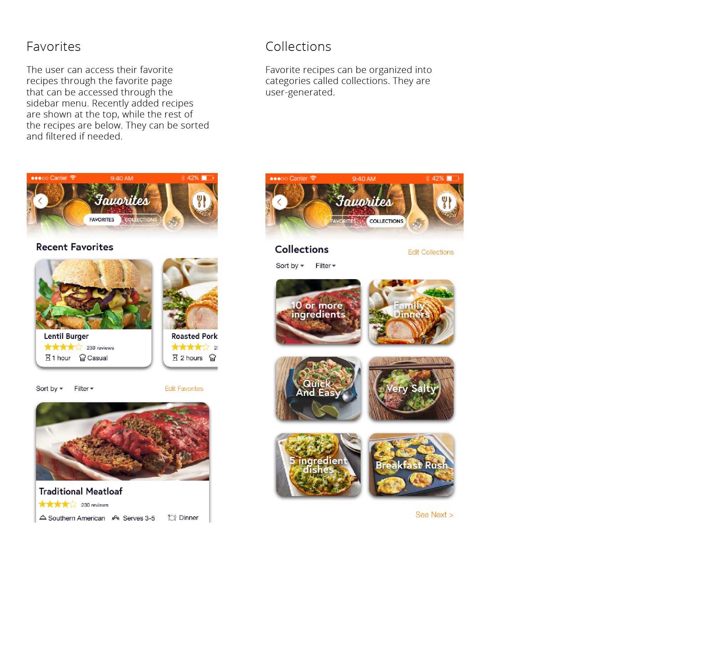

##Demo the prototype
You can access the prototype [here](https://xd.adobe.com/view/81ac2414-fd5c-40cb-b41d-19186cab0baf/)

##Background & Role
This project was made for a Human-Centered Interaction class. I served as the Designer for this project and largely helped mold the interaction experience. I drafted the sketches, created the mockups for brainstorming and research, and finalized the prototype.
The applications used from beginning to end were: Moqups, Adobe XD, Adobe Photoshop. Free resources from Icons8 were used.

##Objectives
The main user and feature goals were:

1. Be efficient in helping users find the recipes they need
2. Create an interface that is easy to navigate and use. Searching by ingredient must be intuitive and simple.
3. Provide familiar and regular features as any recipe application would have

##Learnings

1. Small details such as triggers, actions, buttons, and icons help make the experience go smoothly. A designer's intention doesn't necessarily translate well to a user's perspective. Not only did I have to ask for feedback on the app, but also how users would see an icon and think what it does
2. Feedback is so important to the growth of a product. What WeCook once was and how the finalized product turned out to be (and what it could still potentially be) was very different. Changes are opportunities for growth.

